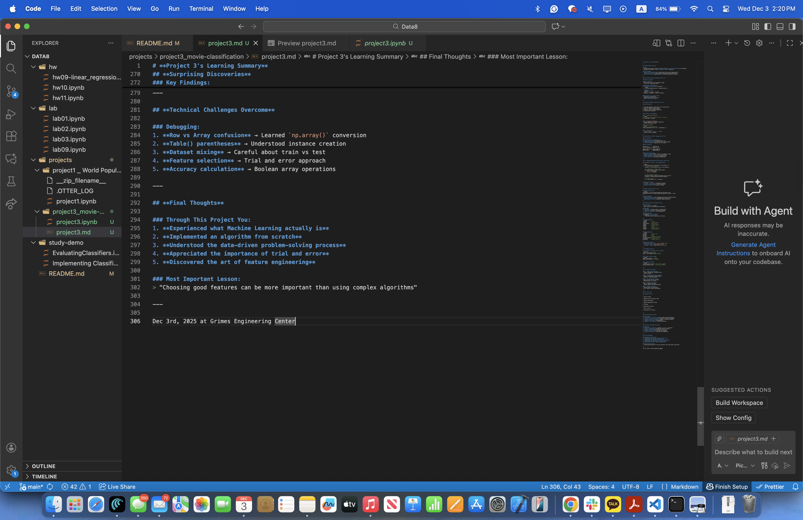

# **Project 3: Movie Classification**

---

## **Understanding Project**

### Goal:
- Classify movie genres (comedy vs thriller) using **only word frequencies** from screenplays
- Implement and evaluate **K-Nearest Neighbors (K-NN)** algorithm

### Core Concepts:
- **Bag-of-words representation**: Ignore word order, only frequency matters
- **Feature engineering**: Good feature selection determines performance
- **Train/test split**: Separate data for training and evaluation (85%/15%)

---

## **Data Preprocessing & Exploration (Part 1)**

### What I Learned:

#### Word Stemming:
- Reduce words to base form (managing → manag)
- `vocab_table` maps stem ↔ word

#### Exploratory Data Analysis:
- **Correlation coefficient** calculation:
  ```python
  r = np.mean(standard_units(x) * standard_units(y))
  ```
- **Regression line**:
  ```python
  slope = r * np.std(y) / np.std(x)
  intercept = np.mean(y) - slope * np.mean(x)
  ```

#### Importance of Train/Test Split:
- Train only on training set
- Evaluate performance on test set
- **Never train on test data**

---

## **K-Nearest Neighbors Algorithm (Part 2)**

### How K-NN Works:

```
1. Calculate distances: Test movie ↔ All training movies
2. Sort: By distance (nearest first)
3. Select k: Take k nearest neighbors
4. Majority vote: Most common genre wins
5. Classification complete!
```

### Functions Implemented:

#### 1. `distance_two_features()`
```python
# Euclidean distance between two movies (2 features)
D = √((x₁-x₂)² + (y₁-y₂)²)
```

#### 2. `distance_from_python()`
- Learned importance of function reusability
- Leverage existing functions

#### 3. `most_common()`
```python
# Majority vote implementation
counts.group(label).sort('count', descending=True)
```

#### 4. K-NN Process:
- `.with_column()` + `.sort()` + `.take()`
- Finding k nearest neighbors

---

## **Importance of Feature Engineering (Part 3)**

### Key Learnings:

#### Characteristics of Good Features:
1. **Discriminative**: Distinguishes genres well
2. **Appropriate frequency**: Not too rare, not too common
3. **Off the diagonal**: Appears more in one genre

#### Plot Analysis:
```
Top Left (2)      |  Top Right (1)
Thriller-specific |  Common in both
__________________|__________________
Bottom Left (4)   |  Bottom Right (3)
Rare in both      |  Comedy-specific
```

#### Practical Experience:
- **People's names** (freddi, caesar) → Too specific, avoid
- **General emotion/action words** → More effective
- **Check commonality**: Hover on interactive plot
- **Trial and error**: Test multiple combinations

---

## **5. Implementing Generalized Classifier (Part 3.2)**

### `classify()` Function - Core Implementation:

```python
def classify(test_row, train_features, train_labels, k):
    # 1. Calculate all distances
    distances = fast_distances(test_row, train_features)
    
    # 2. Create Genre + Distance table
    genre_and_distances = Table().with_columns(
        'Genre', train_labels,
        'Distance', distances
    )
    
    # 3. Sort & select k nearest
    sorted_by_distance = genre_and_distances.sort('Distance')
    k_nearest = sorted_by_distance.take(np.arange(k))
    
    # 4. Majority vote
    return most_common('Genre', k_nearest)
```

### Important Lessons:
- **`Table()` vs `Table`**: Parentheses required
- **Function generalization**: Works on any data
- **Wrapper function**: Fix specific settings

---

## **Model Evaluation (Part 3.3)**

### Calculating Accuracy:
```python
test_guesses = test_my_features.apply(classify_feature_row)
proportion_correct = np.count_nonzero(test_guesses == actual) / total
```

### Error Analysis:
- **Pattern discovery**: Horror/suspense thrillers often misclassified
- **Misclassification table**: Identify where failures occur
- **Improvement direction**: Reconsider feature selection

---

## **Feature Selection (Part 4)**

### Constraints:
- **Only 5 features** allowed
- Fewer features can achieve better performance!

### Strategy:
1. **Balance**: 3 thriller words + 2 comedy words
2. **Use plot**: Top-left & bottom-right regions
3. **Quality > Quantity**: 5 can outperform 10

### Actual Results:
- 5 features: **75.7% accuracy**
- 10 features: **70% accuracy**
    - Well-chosen fewer features more effective

---

### Table Operations:
```python
.where()          # Filter
.select()         # Select columns
.with_column()    # Add column
.apply()          # Apply function
.group()          # Group & count
.sort()           # Sort
.take()           # Select rows
.column()         # Extract as array
.item()           # Extract value
```

### NumPy Operations:
```python
np.sqrt()         # Square root
np.sum()          # Sum
np.mean()         # Mean
np.std()          # Standard deviation
np.count_nonzero()# Count True values
np.arange()       # Create array
np.array()        # Convert to array
```

### Important Patterns:
- **Row → Array conversion**: `np.array(table.row(i))`
- **Boolean arrays**: `test_guesses == actual`
- **`.apply()` usage**: Apply function to all rows

---

## **Debugging Lessons**

### 1. TypeError: Row operations not allowed
```python
array = table.row(0) #WRONG
array = np.array(table.row(0)) #CORRECT
```

### 2. Table creation mistake
```python
Table.with_columns(...) #WRONG
Table().with_columns(...) #CORRECT
```

### 3. Dataset confusion
```python
train_my_features.row(0)  # Wrong dataset (WRONG)
test_my_features.row(0)   # Test movie (CORRECT)
```

---

## ML Principles I Learned:

#### 1. **Supervised Learning**:
- Train on labeled data (comedy/thriller)
- Predict new data

#### 2. **Distance-based Classification**:
- Similar items belong to same category
- Distance = similarity measure

#### 3. **Preventing Overfitting**:
- Never use test set for training
- Generalization is the goal

#### 4. **Feature Importance**:
- Not all features are equal
- Feature selection drives performance

#### 5. **Model Evaluation**:
- Accuracy alone is insufficient
- Error analysis reveals improvements

---

## **Workflow**

### Complete Process:

```
1. Define problem
   ↓
2. Exploratory Data Analysis (EDA)
   ↓
3. Feature Engineering
   ↓
4. Model Implementation (K-NN)
   ↓
5. Training
   ↓
6. Evaluation (Testing)
   ↓
7. Error Analysis
   ↓
8. Improvement & Iteration
```

---

## Key Findings:
1. **5 features > 10 features**: Quality matters more than quantity
2. **Horror films hard to classify**: Feature selection limitations
3. **Interactive plot usefulness**: Helpful for feature selection
4. **People's names trap**: Low commonality
5. **Diagonal line meaning**: No genre distinction

---

## **Technical Challenges Overcome**

### Debugging:
1. **Row vs Array confusion** → Learned `np.array()` conversion
2. **Table() parentheses** → Understood instance creation
3. **Dataset mixing** → Careful about train vs test
4. **Feature selection** → Trial and error approach
5. **Accuracy calculation** → Boolean array operations

---

## **Final Thoughts**

### Through This Project You:
1. **Experienced what Machine Learning actually is**
2. **Implemented an algorithm from scratch**
3. **Understood the data-driven problem-solving process**
4. **Appreciated the importance of trial and error**
5. **Discovered the art of feature engineering**

### Most Important Lesson:
> "Choosing good features can be more important than using complex algorithms"

---

Dec 3rd, 2025 at Grimes Engineering Center

